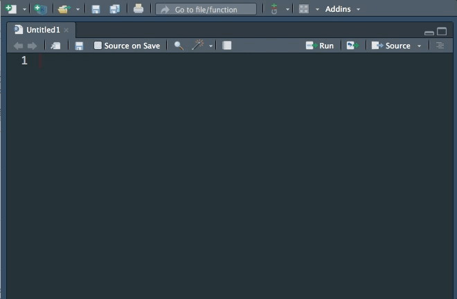

---
output:
  md_document:
    variant: markdown_github
---

<!-- README.md is generated from README.Rmd. Please edit that file -->

```{r, echo = FALSE}
knitr::opts_chunk$set(
  collapse = TRUE,
  comment = "#>",
  fig.path = "README-"
)
```

# remedy

`{remedy}` provides addins to facilitate writing in markdown with RStudio.


All the functions are meant to be mapped to keyboard shortcuts. A list of suggested shortcuts is provided towards the end of this README. 

> Note that most of the addins/shortcuts below will also work without selecting any text.

## Install

```{r, eval = FALSE}
devtools::install_github("ThinkR-open/remedy")
```

Once you've installed the package, you don't need to load it with `library()`, the addins are installed on your machine as part of the package install process. 

## Using `{remedy}`

Write quicker in markdown with `{remedy}`!

Here's a list of all available helpers:


### Align

Align selected blocks to their assignment operator, either `<-`


or `=`


### Backtick

Enclose the selected word(s) in backticks. 


### Chunk

Turn the selected text into a chunk.


### Emphasise

Embolden, italicize or strikethrough the selected text.


### Headers

Turn the selected text into a header.


### Image

Turn the selected path into an image. 

This element is context aware: if you select a text and a link, it turns the text into title between `![]`, and puts the link between `()`. 

If the last element of the selection is not a link, you get an error message straight into you markdown document. 


### LaTeX

LaTeX syntax : 


### List

Turn the selected text into an unordered list. 


### Moving 

#### On the right 

Copy the selected text or the current line to the right.


### Table

Insert a table inside your doc.

There are basically two way to do that with remedy : 

#### Empty table


#### Parse your data 

Turn your dataframe into a markdown table :


### URL

Turn the selected text into an url. 

This element is context aware: if you select a text and a link, it turns the text into title between `[]`, and puts the link between `()`. 

If the last element of the selection is not a link, you get an error message straight into you markdown document. 


### xaringan 

Insert a xaringan pull-left and pull-right template. 




## Recommended shortcuts

Here's a list of recommended shortcuts: 

### On mac 

You can run `remedy::set_hotkeys` to have the package update for you the hotkey settings for your RStudio IDE. If you want to edit the default settings you can view the defaults `remedy_opts$get('hotkeys')` and change them through `remedy_opts$set(hotkeys=<NEW_SETTINGS>)`.

```{r}
remedy::remedy_opts$get('hotkeys')
```

<!-- 
Due to a [limitation](https://community.rstudio.com/t/keyboard-shortcut-for-addin-in-dcf-file/2753) currently of the IDE you will need to restart the IDE once for the hotkeys to be initialized. 
-->

## Feedbacks and enhancement

You've found a bug, or have an enhancment idea? Feel free to open an issue : [https://github.com/ThinkR-open/remedy/issues](https://github.com/ThinkR-open/remedy/issues). 
